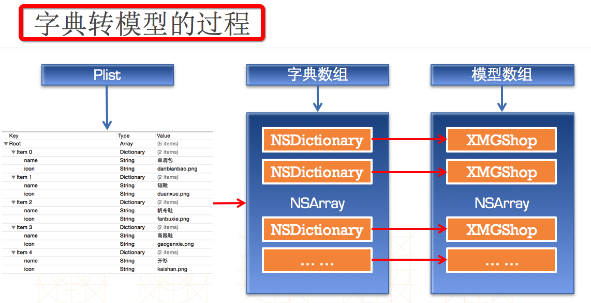

## 基础控件的使用
### UIButton
- 3种状态
  - UIControlStateNormal(常态)
  - UIControlStateHighlighted（长按高亮）
  - UIControlStateDisabled（不可用）
  - 如果自己设置按钮，按钮的状态必须为custom

### 按钮常见设置：set与get

```objc
-(void)setTitle:(NSString*)title forState:(UIControlState)state;
设置按钮文字
-(void)setTitleColor:(UIColor*)color forState:(UIControlState)state;
设置按钮文字颜色
-(void)setImage:(UIImage*)image forState:(UIControlState)state;
设置按钮内部的小图片
-(void)setBackgroundImage:(UIImage*)image forState:(UIControlState)state;
设置按钮背景图片
btn.titleLabel.font=[UIFont systemFontOfSize:12]
设置按钮的文字字体得拿到按钮内部的label来设置
```

```objc
-(NSString*)titleForState:(UIcontrolState)state;
获得按钮的文字
-(UIColor*)titleColorForState:(UIControlState)state
获得按钮文字的颜色
-(UIImage*)imageForState:(UIControlSate)state;
获得按钮内部的小图片
-(UIImage*)backgroundImageForState:(UIControlState)state;
获得按钮的背景图片
```
### storyboard设置与代码的转换
- storyboard 设置如下

- 代码表述如下
```objc
UIButton *btn=[UIButton buttonWithType:UIButtonTypeCustom];
[btn setTitle:@"点我啊" forState:UIControlStateNormal];
[btn setTitleColor:[UIColor redColor] forSate:UIControlStateNormal];
[btn setBackgroundImage:[UIImage imageNamed:@"btn_01"] forState:UIContolStateNormal]
```

### 九宫格布局计算


### plist文件
属性列表文件，有利于提升代码的扩展性，一般存储NSArray或者NSDictionary

```objc
- 解析Plist文件
  NSBundle *bundle=[NSBundle mainBundle];
  NSString *path=bundle pathForResource:@"shops" ofType:@"plist"];
- 加载plist文件
  _shops=[NSArray arrayWithContentOfFile:path];
```
- Plist文件使用注意
- 文件名不能叫做“info”、“Info”
- 添加Plist文件时一定要勾选 Add to targets

### 模型取代字典
- 使用字典的坏处
  - 字典key要手敲，编码效率低，再者敲的过程中，没有提示，容易出错
- 使用模型的好处
  - 数据模型可以专门用来存放数据的对象，模型通过属性来set与get数据，这样编译器可以提示，保证数据的正确性，同时也提高了编码效率。
- 字典转模型
  - 整个字典转模型的过程都封装在模型内部
  - 模型最好只提供一个传入字典参数的构造方法
  ```objc
    - -(instancetype)initWithDict:(NSDictionary*) dict;
    - +(instancetype)xxxWithDict:(NSDictionary*)dict;
    ```
- 备注
  instancetype与id一样，都可以表示任何对象类型。不同的是，instancetype只能用在返回值上，不能像id可以用在参数类型上，但编译器会检测instancetype的真实类型。

- 字典转模型的过程如下所示


### view的封装
- 封装view的步骤
   - 1:在initWithFrame：添加子控件，提供便利构造方法
   - 2:在layoutSubviews：设置子控件的frame（一定要调用super的layoutSubviews）
   - 3:增加模型数据，重写模型set方法，设置数据到子控件

### Xib与storyboard
- 共同点：都是借助Interface Builder工具创建控件，描述界面
- 不同点：Xib是轻量级的，描述局部UI界面，Storyboard是重量级，描述整个软件的界面，还可以展示多个界面之间的跳转关系

###加载Xib
```objc
NSArray *views=[[NSBundle mainBundle]loadNibNamed:@"xib文件名" owner:nil options:nil]
或者
UINib *nib=[UINib nibWithNibname:@"xib文件名" bundle:nil];
NSArray *views=[nib instantiateWithOwner:nil options:nil];
```
### 使用xib自定义view
- 修改xib的view类名
- 封装xib的加载过程
```objc
  @instancetype xXX:UIView
  +(instancetype)xXX;
  @end
  @implementation xXX
  +(instancetype)xXX
  {
    return [[[NSBundle mainBundle]loadNibNamed:@"xXX" owner:nil options:nil]lastObject];
  }
  @end
```

### 控件初始化
- 创建控件有2种方法：一是使用代码创建 二是使用xib或者storyboard创建
- 通过代码创建的控件初始化时会调用initWithFrame：方法
- 通过xib或者storyboard创建的控件调用initWithCoder：方法，同时，初始化完毕会调用awakeFromNib方法

###常用控件的设置

```objc
- UIImage
  - UIImage *image=[UIImage imageNamed:@"XX"];
- UILabel
  - @property(nonatomic,copy) NSString* text;
  - @property(nonatomic,retain)UIfont* font;
  - @property(nonatomic,retain)UIColor* textColor;
  - @property(nonatomic)NSTextAlignment* textAlignment;
- UIFont
  - +(UIFont*)systemFontOfSize:(CGFloat)fontSize;
  - +(UIFont*)boldsSystemFontofSize:(CGFloat)fontSize;
  - +(UIFont*)italicSystemFontOfSize:(CGFloat)fontSize;
```

### HUD
- 其他说法：指示器、遮盖、蒙板
- 半透明HUD的做法
    - 背景色设置为半透明颜色

### 定时任务
- 方法1：performSelector

```objc
// 1.5s后自动调用self的hideHUD方法
[self performSelector:@selector(hideHUD) withObject:nil afterDelay:1.5];
```
- 方法2：GCD

```objc
dispatch_after(dispatch_time(DISPATCH_TIME_NOW, (int64_t)(1.5 * NSEC_PER_SEC)), dispatch_get_main_queue(), ^{
    // 1.5s后自动执行这个block里面的代码
    self.hud.alpha = 0.0;
});
```
- 方法3：NSTimer

```objc
// 1.5s后自动调用self的hideHUD方法
[NSTimer scheduledTimerWithTimeInterval:1.5 target:self selector:@selector(hideHUD) userInfo:nil repeats:NO];
// repeats如果为YES，意味着每隔1.5s都会调用一次self的hidHUD方法
```

### 常见问题
- 项目里面的某个.m文件无法使用
    - 检查：Build Phases -> Compile Sources
- 项目里面的某个资源文件（比如plist、音频等）无法使用
    - 检查：Build Phases -> Copy Bundle Resources
- 一个控件看不见有哪些可能？
  - 宽度或者高度其实为0
  - 位置不对（比如是个负数或者超大的数，已经超出屏幕）
  - hidden == YES
  - alpha <= 0.01
  - 没有设置背景色、没有设置内容
  - 可能是文字颜色和背景色一样


