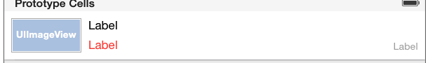
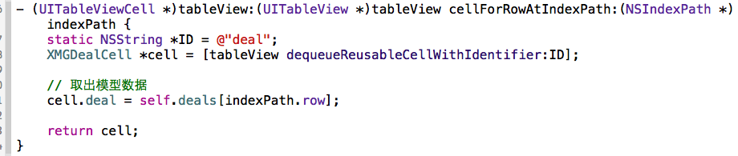
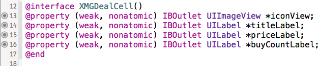

## 自定义cell
- ### 等高的cell
    - ### storyboard自定义cell
        - 1.创建一个继承自UITableViewCell的子类，比如XMGDealCell 

        - 2.在storyboard中
            - 往cell里面增加需要用到的子控件 

            - 设置cell的重用标识 

            - 设置cell的class为XMGDealCell 

        - 3.在控制器中
            - 利用重用标识找到cell
            - 给cell传递模型数据 
 
        - 4.在XMGDealCell中
            - 将storyboard中的子控件连线到类扩展中 
 
            - 需要提供一个模型属性，重写模型的set方法，在这个方法中设置模型数据到子控件上 
  
 
    
     - ### xib自定义cell
        - 1.创建一个继承自UITableViewCell的子类，比如XMGDealCell 
        - 2.创建一个xib文件（文件名建议跟cell的类名一样），比如XMGDealCell.xib
            - 拖拽一个UITableViewCell出来
            - 修改cell的class为XMGDealCell
            - 设置cell的重用标识
            - 往cell中添加需要用到的子控件
        - 3.在控制器中
            - 利用registerNib...方法注册xib文件
            - 利用重用标识找到cell（如果没有注册xib文件，就需要手动去加载xib文件）
            - 给cell传递模型数据 
        - 4.在XMGDealCell中
            - 将xib中的子控件连线到类扩展中
            - 需要提供一个模型属性，重写模型的set方法，在这个方法中设置模型数据到子控件上
            - 也可以将创建获得cell的代码封装起来（比如cellWithTableView:方法）
    
    - ### 代码自定义cell(使用frame)
        - 1.创建一个继承自UITableViewCell的子类，比如XMGDealCell
            - 在initWithStyle:reuseIdentifier:方法中
                - 添加子控件
                - 设置子控件的初始化属性（比如文字颜色、字体）
            - 在layoutSubviews方法中设置子控件的frame
            - 需要提供一个模型属性，重写模型的set方法，在这个方法中设置模型数据到子控件
        - 2.在控制器中
            - 利用registerClass...方法注册XMGDealCell类
            - 利用重用标识找到cell（如果没有注册类，就需要手动创建cell）
            - 给cell传递模型数据
            - 也可以将创建获得cell的代码封装起来（比如cellWithTableView:方法）
            
    - ### 代码自定义cell(使用autolayout)
        - 1.创建一个继承自UITableViewCell的子类，比如XMGDealCell
            - 在initWithStyle:reuseIdentifier:方法中
                - 添加子控件
                - 添加子控件的约束（建议使用`Masonry`）
                - 设置子控件的初始化属性（比如文字颜色、字体）
            - 需要提供一个模型属性，重写模型的set方法，在这个方法中设置模型数据到子控件
        - 2.在控制器中
            - 利用registerClass...方法注册XMGDealCell类
            - 利用重用标识找到cell（如果没有注册类，就需要手动创建cell）
            - 给cell传递模型数据
            - 也可以将创建获得cell的代码封装起来（比如cellWithTableView:方法）

- ### 非等高的cell
    
     - ### xib自定义cell(重点)
        - 在模型中增加一个cellHeight属性，用来存放对应cell的高度
        - 在cell的模型属性set方法中调用[self layoutIfNeed]方法强制布局，然后计算出模型的cellheight属性值
        - 在控制器中实现tableView:estimatedHeightForRowAtIndexPath:方法，返回一个估计高度，比如200
        - 在控制器中实现tableView:heightForRowAtIndexPath:方法，返回cell的真实高度（模型中的cellHeight属性）
    
     - ### storyboard自定义cell 
     - ### 代码自定义cell（frame） 
     - ### 代码自定义cell（Autolayout） 
