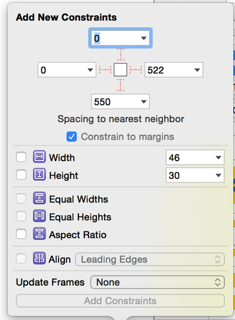
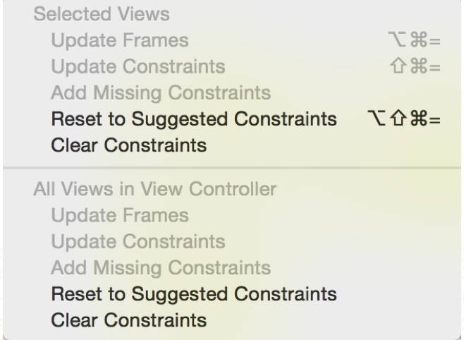

## Autolayout

- 屏幕适配，适应不同方向，不同尺寸的屏幕
     - Iphone尺寸：3.5inch、4.0inch、4.7inch、5.5inch
     - Ipad尺寸：7.9inch、9.7inch
   
- Autoresizing技术
     - 让横竖屏适配相对简单
     - 让子控件可以跟随父控件的行为自动发生相应的变化
     - 前提是：关闭Autolayout功能
     - 局限性
         - 只能解决子控件跟父控件的相对关系问题
         - 不能解决兄弟控件的相对关系问题

- Autolayout 布局UI界面,2个核心概念，参照和约束
     - 三个常用面板
     - 对齐面板
     
     - 相对面板
     
     - 约束处理面板
     
- 代码实现Autolayout

  ```objc
  一个NSLayoutConstraint对象代表一个约束
  创建约束的方法
  +(id)constraintWithItem:(id)view1    attribute:(NSLayoutAttribute)attr1
  relatedBy:(NSLayoutRelation)relation toItem:(id)view2 attribute:(NSlayoutAttribute)attr2 mutiplier:(CGFloat)multiplier constant:(CGFloat)c
  ```
   - view1:要约束的控件
   - attr1：约束的类型
   - relation:与参照控件的关系
   - view2：参照的控件
   - attr2：约束的类型
   - multiplier：乘数
   - c：常量
   - 步骤：
     - 创建NSLayoutContraint类对象
     - 添加约束到相应的view上
         - -(void)addConstraint:(NSlayoutConstraint*)constraint;
         - -(void)addConstraints:(NSArray*)constraints
     - 注意点
         - 先禁止autoresizing功能
         - view.translatesAutoresizingMaskIntoCOntraints=NO
         - 添加控件约束之前，要保证控件在各自的父控件上
         - 不用再给view设置frame
     -添加约束的规则
         - 对于2个同层级的view，约束添加到它们的父view
         - 对于2个不同层级view之间的约束，添加到它们最近的共同父view上
         - 对于有层次关系的2个view之间的约束关系，添加到层次较高的父view
- 自动布局计算公式
  - obj1.property1 =（obj2.property2 * multiplier）+ constant value
- VFL语言
  - VFL(Visual Format Language)可视化格式语言

```objc
H:[cancelButton(72)]-12-[acceptButton(50)]
canelButton宽72，acceptButton宽50，它们之间间距12

H:[wideView(>=60@700)]
wideView宽度大于等于60point，该约束条件优先级为700（优先级最大值为1000，优先级越高的约束越先被满足）

V:[redBox][yellowBox(==redBox)]
竖直方向上，先有一个redBox，其下方紧接一个高度等于redBox高度的yellowBox

H:|-10-[Find]-[FindNext]-[FindField(>=20)]-|
水平方向上，Find距离父view左边缘默认间隔宽度，之后是FindNext距离Find间隔默认宽度；再之后是宽度不小于20的FindField，它和FindNext以及父view右边缘的间距都是默认宽度。（竖线“|” 表示superview的边缘
```
- VFL的使用

```objc
使用VFL来创建约束数组
+ (NSArray *)constraintsWithVisualFormat:(NSString *)format options:(NSLayoutFormatOptions)opts metrics:(NSDictionary *)metrics views:(NSDictionary *)views;
format ：VFL语句
opts ：约束类型
metrics ：VFL语句中用到的具体数值
views ：VFL语句中用到的控件

创建字典（内部包含VFL语句中的控件）
NSDictionary *viewsDictionary = NSDictionaryOfVariableBindings(
deleteButton, cancelButton, nextButton);
等价于
NSDictionary *viewsDictionary = @{ @"deleteButton": deleteButton, @"cancelButton": cancelButton, @"nextButton": nextButton
};

```
- 基于Autolayout的动画
  - [UIView animateWithDuration:1.0 animations:^{
       加入动画操作
    }]
- Masonry框架
   - 相当方便编写Autolayout代码，并且可读性也极高
   - 如果添加下面的2个宏，那么就可以忽略mas前缀
      - #####define MAS_SHORTHAND_GLOBALS
      - #####define MAS_SHORTHAND
      - 注意：这个宏一定要添加到#import "Masonry.h"前面


