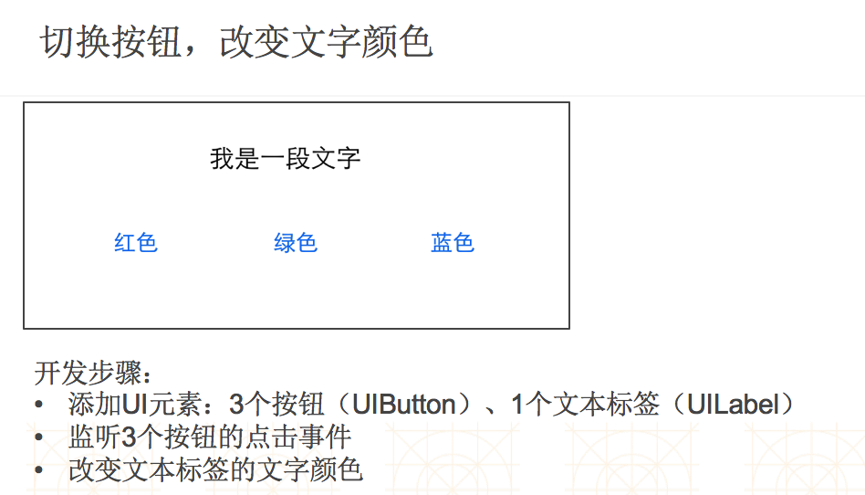

### APP开发步骤
- 搭建基本的软件界面
- 获得网络数据
- 显示数据到软件界面

### 常用框架
- UIKit(含各种UI元素：UIButton、UILabel、UIImageView等)
- QuartzCore(支持图像处理和视频图像处理)
- MapKit(显示世界地图)
- CoreLocation(定位)
- AVFoundation(拍照、录视频)

### 类扩展
- 格式
```objc
@interface 类名()
/** 属性、方法的声明 */
@end
```
- 作用
    - 为某个类增加额外的属性和方法声明
    - 写在.h或.m文件

### 项目属性
- Product Name
    - 软件名称、产品名称、项目名称
- Organization Name
    - 公司名称、组织名称
- Organization Identifier
    - 公司的唯一标识
    - 一般是公司域名的反写，比如com.520it
- Bundle Identifier
    - 软件的唯一标识
    - 一般是Organization Identifier + Product Name

### 示例

 

### UIViewController（控制器）
- 一个控制器负责管理一个大界面
- 控制器负责界面的创建、事件处理等

### 认识storyboard
 - 描述软件界面
 - 默认情况下，程序一启动就会加载Main.storyboard
 - 加载storyboard时，会首先创建和显示箭头所指的控制器界面

#### IBOutlet和IBAction
  - IBOutlet
      - 让属性具备连线的功能
  - IBAction：
      - 本质就是void
      - 让方法具备连线的功能

#### 使用storyboard常见错误
  - 连接的方法代码被删掉，但是连线没有去掉
    - unrecognized selector sent to instance
  - 连接的属性代码被删掉，但是连线没有去掉
    - setValue:forUndefinedKey:]: this class is not key value coding-compliant for the key


