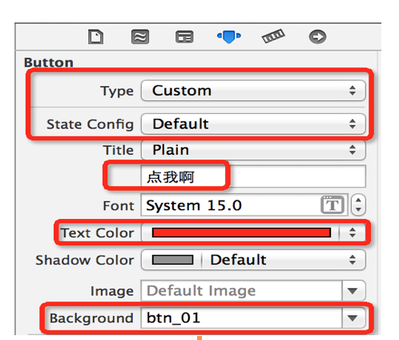

## UIView

### 控件是什么？
- UI元素都是控件
- 所有控件都继承自UIView，UIView是最纯净的控件
- 控件是一种容器，可以加到别的控件，也可以在自身加入其他控件
- 控件有许多共同属性（尺寸、位置、背景等等）
- 备注：每一个控制器（UIViewController）内部都有一个UIView属性，所以控制器所管理的其他控件都是这个View的子控件（直接或间接）

### UIView常见属性

- @property(nonatomic,readonly)UIView* superview;  获得view的父控件对象
- @property(nonatomic,readonly,copy)NSArray* subviews;  获得view的子控件数组
  - NSArray *subviews
    - 所有的子控件
    - 数组元素的顺序决定着子控件的显示层级顺序（下标越大的，越显示在上面）
- @property(nonatomic)NSInteger tag;  控件的ID标识,父控件可以通过tag来找到对应的子控件
- @property(nonatomic)CGAffineTransfom transform;  控件的变形属性，包含旋转角度、比例缩放、平移等
- @property(nonatomic)CGRect frame;  控件矩形框在父控件中的尺寸和位置，坐标原点为父控件左上角
- @property(nonatomic)CGRect bounds;  控件矩形框的尺寸和位置，只是它坐标原点是自己的左上角
- @property(nonatomic)CGPoint center;  控件中心点的位置，参照系是父控件左上角

### UIView常见方法

- (void)addSubview:(UIView*)view;  添加一个子控件
- (void)removeFromSuperview;  将自己从父控件中移除
- (UIView*)viewWithTag:(NSInteger)tag;  父控件根据tag值找出子控件

- 可以使用下面的方法调整子控件在subview数组中的顺序

```objc
// 将子控件view插入到subviews数组的index位置
- (void)insertSubview:(UIView *)view atIndex:(NSInteger)index;

// 将子控件view显示到子控件siblingSubview的下面
- (void)insertSubview:(UIView *)view belowSubview:(UIView *)siblingSubview;
// 将子控件view显示到子控件siblingSubview的上面
- (void)insertSubview:(UIView *)view aboveSubview:(UIView *)siblingSubview;

// 将子控件view放到数组的最后面，显示在最上面
- (void)bringSubviewToFront:(UIView *)view;
// 将子控件view放到数组的最前面，显示在最下面
- (void)sendSubviewToBack:(UIView *)view;


### UIKit坐标系

### UI控件概览

- 常用控件
  - UIButton  按钮  
  - UILabel  文本标签
  - UIImageView  图片显示
  - UITextField 文本输入框
  - UISrollView  滚动控件
  - UITableView  表格
  - UICollectionView  九宫格
  - UIWebView  网页显示
  - UIAlertView  对话框
  - UINavigationBar  导航条
- 一般使用控件
  - UIpageControl  分页
  - UITextView  可以滚动的文字显示
  - UIActivityIndicator  圈圈
  - UISwitch  开关
  - UIActionSheet  底部弹框
  - UIDatePicker  日期选择器
- 不常用控件
  - UIToolbar 工具条
  - UIProgressView 进度条
  - UISlider 滑块
  - UISegmentControl 选项卡
  - UIPickerView 选择器
  


