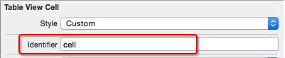

## UITableView
- 2种样式
  - UITableViewStylePlain(单组数据)
  - UITableViewStyleGrouped(多组数据)
- UITableView如何显示数据
    - 设置dataSource数据源
    - 数据源要遵守UITableViewDataSource协议
    - 数据源要实现协议中的某些方法
- UITableView与数据源
  
- UITableView常用数据源方法
```objc
  告诉tableView一共有多少组数据
- (NSInteger)numberOfSectionsInTableView:(UITableView *)tableView

  告诉tableView第section组有多少行
- (NSInteger)tableView:(UITableView *)tableView numberOfRowsInSection:(NSInteger)section

  告诉tableView第indexPath行显示怎样的cell
- (UITableViewCell *)tableView:(UITableView *)tableView cellForRowAtIndexPath:(NSIndexPath *)indexPath

  告诉tableView第section组的头部标题
- (NSString *)tableView:(UITableView *)tableView titleForHeaderInSection:(NSInteger)section

  告诉tableView第section组的尾部标题
- (NSString *)tableView:(UITableView *)tableView titleForFooterInSection:(NSInteger)section
```
- 组模型与cell模型

- cell简介
     - UITableView的每一行都是一个UITableViewCell，通过dataSource的tableView:cellForRowAtIndexPath:方法来初始化每一行
     - UITableViewCell内部有个默认的子视图:contentView，contentView是UITableViewCell所显示内容的父视图，可显示一些辅助指示视图
     - 辅助指示视图
         - 作用是显示一个表示动作的图标，可以通过设置UITableViewCell的accessoryType来显示，默认是UITableViewCellAccessoryNone(不显示辅助指示视图)，其他值如下:
  
- UITableViewCell
  - 结构如下

  - contentView
    - 默认有3个子视图：textLabel,detailLabel,imageView
  - UITableViewCellStyle属性
  
- Cell的重用
  - IOS设备内存有限，所以需要重用UITableViewCell对象
  - 原理：当滚动列表时，部分UITableViewCell会移出窗口，UITableView会将窗口外的UITableViewCell放入一个对象池中，等待重用。当UITableView要求dataSource返回UITableViewCell时，dataSource会先查看这个对象池，如果池中有未使用的UITableViewCell，dataSource会用新的数据配置这个UITableViewCell，然后返回给UITableView，重新显示到窗口中，从而避免创建新对象
  - UITableViewCell有个reuseIdentifier属性，可以在初始化UITableViewCell的时候传入一个特定的字符串标识来设置reuseIdentifier(一般用UITableViewCell的类名)。当UITableView要求dataSource返回UITableViewCell时，先通过一个字符串标识到对象池中查找对应类型的UITableViewCell对象，如果有，就重用，如果没有，就传入这个字符串标识来初始化一个UITableViewCell对象

- Cell 重用代码
```objc
- (UITableViewCell *)tableView:(UITableView *)tableView cellForRowAtIndexPath:(NSIndexPath *)indexPath
{
    // 1.定义一个cell的标识
      static NSString *ID = @”czcell”;
    // 2.从缓存池中取出cell
      UITableViewCell *cell = [tableView dequeueReusableCellWithIdentifier:ID];
    // 3.如果缓存池中没有cell
      if (cell == nil) {
        cell = [[UITableViewCell alloc] initWithStyle:UITableViewCellStyleSubtitle reuseIdentifier:ID];
    }
    // 4.设置cell的属性...
     return cell;
}
```
- Cell循环利用方法一
```objc
/**什么时候调用：每当有一个cell进入视野范围内就会调用*/
- (UITableViewCell *)tableView:(UITableView *)tableView cellForRowAtIndexPath:(NSIndexPath *)indexPath
{
    // 1.重用标识
    // 被static修饰的局部变量：只会初始化一次，在整个程序运行过程中，只有一份内存
    static NSString *ID = @"cell";

   // 2.先根据cell的标识去缓存池中查找可循环利用的cell
    UITableViewCell *cell = [tableView dequeueReusableCellWithIdentifier:ID];

   // 3.如果cell为nil（缓存池找不到对应的cell）
    if (cell == nil) {
        cell = [[UITableViewCell alloc] initWithStyle:UITableViewCellStyleDefault reuseIdentifier:ID];
    }
    // 4.覆盖数据
    cell.textLabel.text = [NSString stringWithFormat:@"testdata - %zd", indexPath.row];

    return cell;
}
```
- Cell循环利用方法二
  
```objc
   - 定义一个全局变量
// 定义重用标识
NSString *ID = @"cell";
```

     
```objc
- 注册某个标识对应的cell类型
// 在这个方法中注册cell
- (void)viewDidLoad {
    [super viewDidLoad];
    // 注册某个标识对应的cell类型
    [self.tableView registerClass:[UITableViewCell class] forCellReuseIdentifier:ID];
}
```
```objc
 - 在数据源方法中返回cell
- (UITableViewCell *)tableView:(UITableView *)tableView cellForRowAtIndexPath:(NSIndexPath *)indexPath
{
    // 1.去缓存池中查找cell
    UITableViewCell *cell = [tableView dequeueReusableCellWithIdentifier:ID];

    // 2.覆盖数据
    cell.textLabel.text = [NSString stringWithFormat:@"testdata - %zd", indexPath.row];

    return cell;
}
```

- Cell循环利用方法三
     - 在storyboard中设置UITableView的Dynamic Prototypes Cell

     - 设置cell的重用标识

     - 在代码中利用重用标识获取cell
```objc
// 0.重用标识
// 被static修饰的局部变量：只会初始化一次，在整个程序运行过程中，只有一份内存
static NSString *ID = @"cell";

// 1.先根据cell的标识去缓存池中查找可循环利用的cell
UITableViewCell *cell = [tableView dequeueReusableCellWithIdentifier:ID];

// 2.覆盖数据
cell.textLabel.text = [NSString stringWithFormat:@"cell - %zd", indexPath.row];

return cell;
```
## UITableView的常见设置
```objc
// 分割线颜色
self.tableView.separatorColor = [UIColor redColor];

// 隐藏分割线
self.tableView.separatorStyle = UITableViewCellSeparatorStyleNone;
```
## UITableViewCell的常见设置
```objc
// 取消选中的样式
cell.selectionStyle = UITableViewCellSelectionStyleNone;

// 设置选中的背景色
UIView *selectedBackgroundView = [[UIView alloc] init];
selectedBackgroundView.backgroundColor = [UIColor redColor];
cell.selectedBackgroundView = selectedBackgroundView;

// 设置默认的背景色
cell.backgroundColor = [UIColor blueColor];

// 设置默认的背景色
UIView *backgroundView = [[UIView alloc] init];
backgroundView.backgroundColor = [UIColor greenColor];
cell.backgroundView = backgroundView;

// backgroundView的优先级 > backgroundColor

// 设置指示器
 cell.accessoryType = UITableViewCellAccessoryDisclosureIndicator;
 cell.accessoryView = [[UISwitch alloc] init];
```


