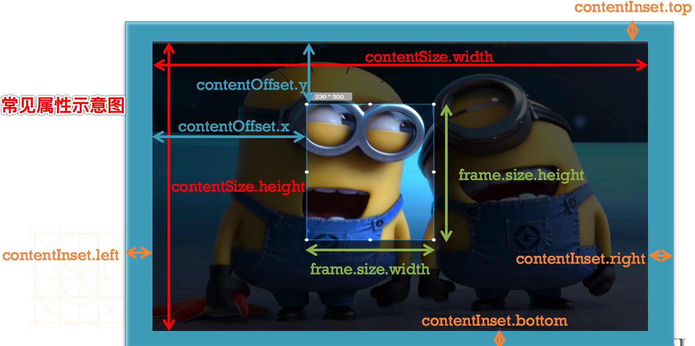
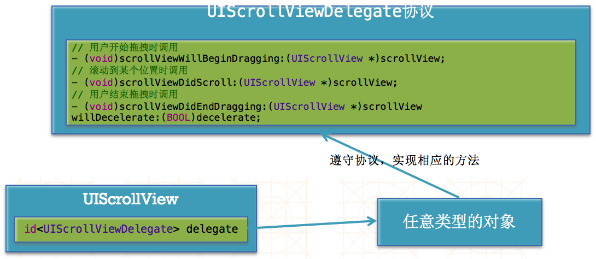

## UIScrollView
- 具有滚动功能，可以弥补手机有限的屏幕，用户通过滚动手势来查看屏幕外的内容。
- 常见属性
```objc
@property(nonatomic)CGSize contentSize;
表示UISrollView内容视图的尺寸，也就是滚动范围
@property(nonatomic)CGPoint contentOffset;
表示滚动位置，是内容左上角与scrollView左上角的向量
@property(nonatomic)UIEdgeInsects contentInsect;
表示在UISrollView四周增加额外的滚动区域，避免内容被其他控件挡住
```
- 示意图如下所示
  
- 其他属性
```objc
  @property(nonatomic)BOOL bounds;
  设置UIScrollView是否需要弹簧效果
  @property(nonatomic,getter=isScrollEnabled)BOOL scrollEnabled;
  设置UISrollView是否能滚动
  @property(nonatomic)BOOL showHorizontalScrollIndicator;
  是否显示水平滚动条
  @property(nonatomic)BOOL showsVerticalScrollIndicator;
  是否显示垂直滚动条
```
- UIScrollView与代理（delegate）
  - 代理监听UIScrolView滚动过程。当UIScrollView发生滚动时，会自动通知它的delegate（代理）。
  - UIScrollView与delegate的通信过程如下：
   
  - 成为delegate的条件，必须遵守UISrollViewDelegate协议，其次实现协议中相应方法，这样就可以监听UIScrollView滚动过程。
   
  - 一般设置UIScrollView所在的控制器为delegate，通过代码设置或者storyboard拖线
- 缩放
  ```objc
  设置完代理之后，设置minimumZoomScale(缩放最小比例)，maxmumZoomScale(缩放最大比例)，实现协议相应方法。
  -(UIView*) viewForZoomingInSrollView:(UIScrollView*)scrollView;
  返回需要缩放的视图控件
  -(void)scrollViewWillBeginZooming:(UIScrollView*)scrollView withView:(UIView*)view；
  缩放时调用
  -(void)scrollViewDidZoom:(UIScrollView*)scrollView;
  缩放结束调用

  ```
- 分页  
  - 

 ```objc
 当将UISrollView的pageEnabled的属性设置为YES，UIScrollView会分割成多个独立页面，所以内容就可以分页展示。
 一般配合UIPageControl（页码指示器）增强分页效果。
 常用属性如下：
 @property(nonatomic) NSInteger numberOfPages;
一共有多少页
 @proerty(noantomic)NSinteger currentPage;
 当前页
 @property(nonatomic)BOOL hideForSinglepage;
 当只有一页时，隐藏页码指示器
 @property(nonatomic,retain)UIColor* currentPageIndicatorTintColor;
 当前页码指示器的颜色
 @property(nonatomic,retain)UIColor* pageIndicatorTintColor;
 其他页码指示器的颜色

 ```
- NSTimer
  - 定时器有2种类型：一种是在指定的时间执行指定的任务
 还有一种是隔一段时间执行指定任务
  - 开启定时器
     - +(NSTimer*)scheduledTimerWithTimInterval:(NSTimeInteval)aTime target:(id)bTarget selector:(SEL)cSelector userInfo:(id)dUserInfo repeats:(BOOL)yesOrNo;
  这个函数的意思就是，每隔aTime秒，调用bTarget的cSelector方法，repeats决定定时任务是否重复
  - 关闭定时器
     - -(void)invalidate,通过这个方法可以停止定时器的工作。
  - 解决定时器在主线程不工作的问题
     - NSTimer *timer=[NSTimer timerWithTimeInterval:2 target:self selector:@selector(next) userInfo:nil repeats:YES]
     - [NSRunLoop mainRunLoop]addTimer:timer forMode:NSRunLoopCommonModes];
- UISrollerView不滚动原因
  - 没有设置contentSize
  - scrollEnabled＝NO
  - 没有接收到触摸事件：userInteractionEnabled＝NO

